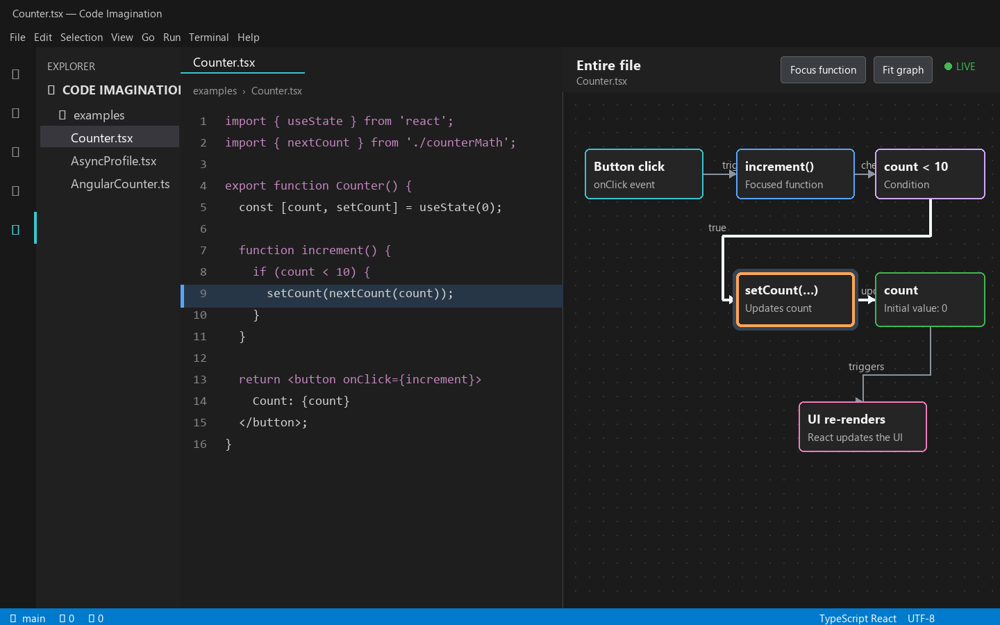

# Code Imagination

Code Imagination is an experimental VS Code extension that turns the function under your cursor into a live visual mental model.

> Preview release: the extension supports React and Angular workflows in JavaScript and TypeScript.

## Install

Select **Install** on this Marketplace page, or search for `Code Imagination` in the VS Code Extensions view.

## Quick start

1. Open a JavaScript, TypeScript, JSX, or TSX file.
2. Place the cursor inside a function or class method.
3. Select **Code Imagination** in the Activity Bar.

The graph updates as you type. Click a node to open and highlight its source code, including definitions in other files.

## What it understands

### JavaScript and TypeScript

- Standalone functions, arrow functions, and class methods
- Conditions, loops, early returns, and visible branch joins
- Ordered local and imported function calls
- Awaited operations and handled, rethrown, or propagated errors
- Expandable `fetch` request method, URL, headers, body fields, and abort signals
- On-demand project-wide **Show usages** results

### React

- Named and inline JSX event handlers
- `useState`, `useReducer`, setter calls, and dispatched actions
- State-to-render relationships and resulting UI updates

### Angular

- `@Component` methods plus inline and external template events
- Signals, inputs, outputs, `computed()`, `effect()`, `.set()`, and `.update()`
- Lifecycle and post-render hooks, host APIs, view queries, forms, and two-way bindings
- Router navigation, guards, resolvers, providers, and injected dependencies
- Typed `HttpClient` requests, RxJS pipelines, NgRx primitives, and signal resources
- Template conditions, loops, bindings, pipes, directives, projection, and hydration intent

## Explore without losing context

- Move the source cursor to highlight the smallest matching node and its connected edges.
- Leave a function and the last focused mental model stays visible.
- Expand helper functions and request details only when you need them.
- Select **Show entire file** for the complete file graph.
- Select **Fit graph** to bring every node into view.

Dependency-aware layout keeps events, functions, conditions, requests, state, and rendering ordered from left to right. Live cursor updates use fast syntax analysis; imported-call resolution and project-wide usage searches load type information only when needed.

## Settings

- `codeImagination.updateDelay` controls the typing debounce.
- `codeImagination.followFocus` enables or disables automatic viewport movement.
- `codeImagination.focusAnimationDuration` controls follow-focus animation speed.

The viewport only moves when the active node is outside the visible canvas. An **ANALYZING** indicator appears while a project model is being refreshed.

## Privacy

All source analysis runs locally in the VS Code extension host. Code Imagination does not upload code, require an account, or call an AI service.

## Current limitations

- Static analysis cannot always resolve dynamic calls or runtime-generated state.
- Runtime-created templates, dynamically selected providers, server-only branches, and values known only after dependency injection cannot be guaranteed by static analysis.
- Request configuration shows source expressions; values computed only at runtime cannot be predicted.
- Class-based React state is not supported yet.
- Very large monorepos still need broader performance testing.

## Roadmap / TODO

- [x] Add Angular support:
  - [x] recognize `@Component` class methods and signal properties;
  - [x] connect inline templates to their component TypeScript files;
  - [x] connect external HTML templates to their component TypeScript files;
  - [x] visualize template events such as `(click)="increment()"`;
  - [x] understand Angular signals and `.set()` / `.update()` state changes;
  - [x] show Angular change detection and the resulting UI update.
  - [x] model inputs, outputs, `EventEmitter`, `computed()`, `effect()`, injected services, and RxJS subscriptions.
  - [x] model lifecycle hooks, view queries, reactive forms, two-way binding, Router navigation, `HttpClient`, common RxJS operators, `*ngIf` / `*ngFor`, and `@if` / `@for`.
  - [x] model host APIs, custom component bindings, async/custom pipes, content projection, NgRx, guards/resolvers, modern resources, providers, and hydration intent.
- [x] Add an on-demand **Used by** view for JavaScript and TypeScript functions:
  - find call sites across the current project;
  - show each usage with its file and line number;
  - open and highlight the selected usage without replacing the current graph;
  - keep usage nodes collapsed until requested so large projects stay readable.
- [ ] Add pluggable language support beyond JavaScript and TypeScript:
  - use VS Code symbol, reference, and call-hierarchy providers for a generic function graph;
  - support function definitions, calls, conditions, async work, and **Used by** references where the installed language tooling provides them;
  - add dedicated analyzers for Python, C#, Java, Go, and Rust incrementally;
  - keep framework-specific state and UI behavior in separate adapters instead of applying React concepts to every language.

If analysis fails, run **Code Imagination: Show Diagnostic Logs** from the Command Palette. Error details are written to the local Code Imagination output channel without including full source contents.

## Feedback and support

- [Report a bug or request a feature](https://github.com/Cna-Wangdi/code-imagination-vscode/issues)
- Read [SUPPORT.md](SUPPORT.md) for diagnostic and reporting guidance.
- View the [source code](https://github.com/Cna-Wangdi/code-imagination-vscode).

## Run locally

1. Install dependencies with `npm install`.
2. Build with `npm run build`.
3. Press `F5` in VS Code.
4. In the Extension Development Host, open `examples/Counter.tsx`.
5. Select the **Code Imagination** icon in the Activity Bar and put the cursor inside `increment`.

The visualization updates automatically while you type. Click a visual node to reveal and highlight its source code. Imported-function nodes open their defining file without replacing the current visualization.

## Verify and package

- Run `pnpm test` for analyzer and graph unit tests.
- Run `pnpm run test:integration` to launch a clean VS Code Extension Host and verify activation, Angular analysis, and cross-file source highlighting.
- Run `pnpm run test:all` for type-checking plus both test layers.
- Run `pnpm run package:vsix` to produce an installable `code-imagination-0.2.0.vsix`.
- Install the VSIX from **Extensions: Install from VSIX...** in the VS Code Command Palette.
